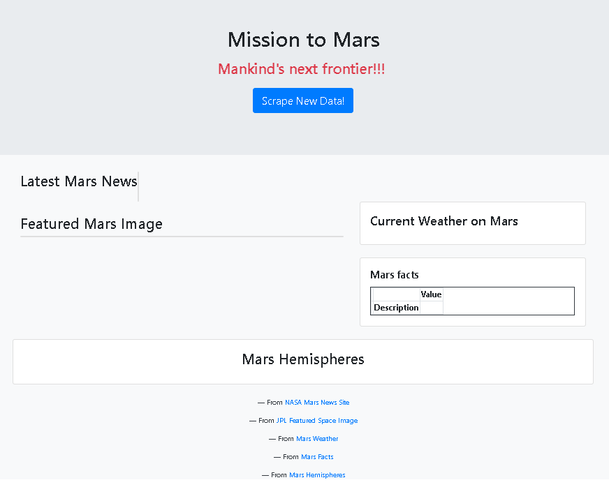
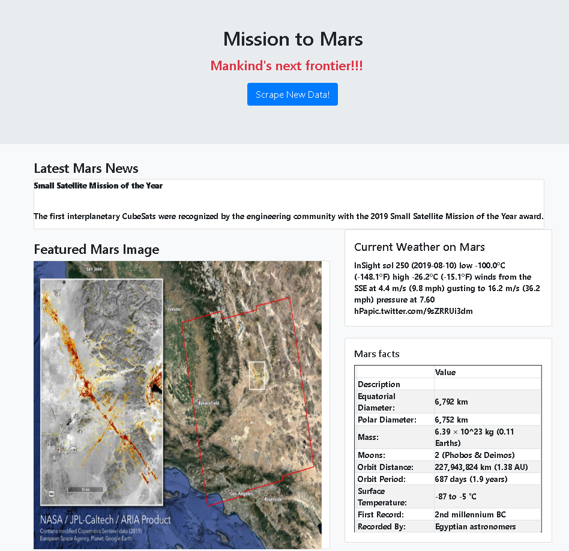
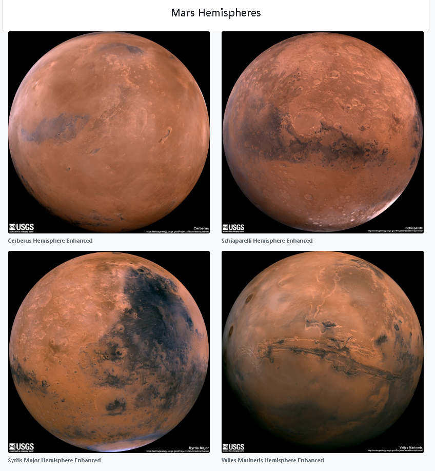

# Mission to Mars

This project is about building a web application that scrapes various websites for data related to the Mission to Mars and displays the information in a single HTML page. The following outlines what have been done.

## Step 1 - Scraping

Initial scraping and analysis are completed using Jupyter Notebook, BeautifulSoup, Pandas, and Requests/Splinter.

* Click [mission_to_mars](mission_to_mars.ipynb) for details. 

Following wesites were scraped to complete this project.

### NASA Mars News

* [NASA Mars News Site](https://mars.nasa.gov/news/) for the latest News Title and Paragraph Text. 

### JPL Mars Space Images - Featured Image

* For JPL Featured Space Image [here](https://www.jpl.nasa.gov/spaceimages/?search=&category=Mars) and using splinter found the image url for the current Featured Mars Image and assigned the url string to a variable called `featured_image_url`.

### Mars Weather

* Mars Weather twitter account [here](https://twitter.com/marswxreport?lang=en) and scraped the latest Mars weather tweet from the page. This tweet text for the weather report is saved to a variable called `mars_weather`.

### Mars Facts

* Mars Facts webpage [here](https://space-facts.com/mars/) was scraped for gathering facts using Pandas about the planet including Diameter, Mass, etc and to convert the data to a HTML table string.

### Mars Hemispheres

* USGS Astrogeology site [here](https://astrogeology.usgs.gov/search/results?q=hemisphere+enhanced&k1=target&v1=Mars) to obtain high resolution images for each of Mar's hemispheres.

## Step 2 - MongoDB and Flask Application

MongoDB with Flask templating was used to create a new HTML page that displays all of the information that was scraped from the URLs.above.

Before:

After scraping:

## Copyright

© 2019 Trilogy Education Services. All Rights Reserved.
